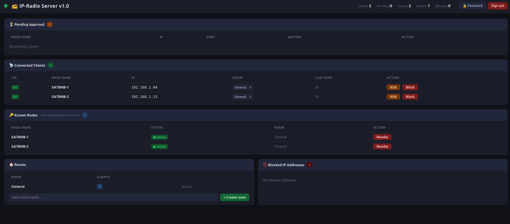

# 📻 IP-Radio v1.0

> Push-to-talk röstradio över UDP/IP — ESP32-C3 klient + Python-server med webbaserat administrationsgränssnitt.



---

## Översikt

IP-Radio är ett egenbyggt PTT-system (Push-To-Talk) som förmedlar 16 kHz mono-PCM-ljud i realtid över ett lokalt nätverk. Systemet består av två delar:

- **Klienten** — firmware för ESP32-C3 Xmini med ES8311-codec, OLED-display, WS2812 RGB-LED och BOOT-knapp som PTT.
- **Servern** — ett Python-program som agerar relay och administrationspanel.

Tänkt användning: industriella interkomsystem, hamradio-experiment, eller andra scenarier där man vill ha walkie-talkie-liknande kommunikation utan att använda befintlig radioinfrastruktur.

---

## Hårdvara (klient)


| Komponent | Detalj |
|---|---|
| Mikrokontroller | ESP32-C3 Xmini |
| Codec | ES8311 (I²S, I²C) |
| Display | SSD1306 OLED 128×64 px |
| LED-indikator | WS2812 RGB (GPIO 2) |
| Förstärkare | NS4150B (GPIO 11, aktiv HÖG) |
| PTT-knapp | BOOT-knappen (GPIO 9, aktiv LÅG) |
| Batteri | LiPo 300 mAh 3,7 V (valfritt) |

---

## Filstruktur

```
├── esp32_code.ino      # Firmware för ESP32-C3 klienten
├── server.py           # Python-server (relay + webb-UI)
└── ipradio_state.json  # Skapas automatiskt — sparar kända noder, rum och blockerade IP
```

---

## Klienten — `esp32_code.ino`

### Funktion

Firmware för ESP32-C3 som ansluter till WiFi och kommunicerar med servern via UDP. Användaren trycker på BOOT-knappen för att sända, precis som en vanlig walkie-talkie.

### Ljudpipeline

**Sändning (TX):**
1. Läser stereo I²S från ES8311-codecen, plockar ut L-kanalen (mikrofon).
2. DC-blockerande högpassfilter (IIR, koefficient 0,995).
3. RMS-beräkning för noise gate (konfigurerbar tröskel).
4. Applicerar TX_GAIN + hårt klipptaket (CLIP_CEILING).
5. Skickar 640-byte UDP-paket (320 samples × 16-bit) med 20 ms intervall.

**Mottagning (RX):**
1. Inkommande UDP-paket buffras i en jitter-buffer (5–8 frames).
2. Spelas upp via I²S till NS4150B-förstärkaren med RX_GAIN-justering.

**Roger-pip:**  
När PTT släpps skickas automatiskt en 1760 Hz sinuston (150 ms) med ADSR-envelope (attack 10 ms, sustain 80 ms, decay 60 ms) — klassisk walkie-talkie-känsla.

### LED-indikering (WS2812)

| Färg | Betydelse |
|---|---|
| 🔴 Röd, fast | PTT aktiv — sänder |
| 🟢 Grön, fast | Tar emot ljud |
| 🟡 Gul, blinkar 1 Hz | Väntar på administratörsgodkännande |
| 🔴 Röd, blinkar 2 Hz | Nekad / blockerad av servern |
| Av | Standby / offline |

### OLED-display

Displayen visar nodens namn, WiFi-ikon, aktuellt rum och kommunikationsstatus (`** TX **`, `RECEIVING`, `STANDBY`, `WAITING APPROVAL`, `ACCESS DENIED`). Den slocknar automatiskt efter 5 sekunders inaktivitet och tänds igen vid PTT eller inkommande ljud.

### Registreringstillstånd

```
REG_NONE → REG_PENDING → REG_ACTIVE
                       ↘ REG_REJECTED (retry efter 60 s)
```

### Protokoll

Binärt UDP-protokoll med 6-byte header:

```
Byte 0-1: Magic (0xA5 0x7B)
Byte 2:   Typ   (HELLO/AUDIO/BYE/PING/PONG/REJECT/ROOM_INFO)
Byte 3:   ClientID
Byte 4-5: SeqNum (uint16, big-endian)
```

### Arduino IDE-inställningar

| Inställning | Värde |
|---|---|
| Board | ESP32C3 Dev Module |
| USB CDC On Boot | Disabled |
| CPU Frequency | 160 MHz |
| Flash Mode | DIO |
| Partition Scheme | Default 4MB with spiffs |
| Upload Speed | 921600 |

### Beroenden

- [arduino-audio-driver](https://github.com/pschatzmann/arduino-audio-driver)
- Adafruit SSD1306 + Adafruit GFX
- Adafruit NeoPixel

### Konfiguration

Redigera dessa rader i toppen av `esp32_code.ino`:

```cpp
#define WIFI_SSID       "DittNätverk"
#define WIFI_PASSWORD   "DittLösenord"
#define SERVER_HOST     "192.168.1.10"
#define SERVER_PORT     12345
#define NODE_NAME       "SA7BNB-1"   // Unikt namn, max 16 tecken
```

---

## Servern — `server.py`

### Funktion

Asynkron Python-server (asyncio + aiohttp) som lyssnar på UDP port 12345 och tillhandahåller ett lösenordsskyddat webbgränssnitt på port 8080. Servern agerar relay — ljud från en klient vidarebefordras till alla andra klienter i samma rum.

### Webbgränssnitt


Webbgränssnittet uppdateras i realtid via Server-Sent Events (SSE) och erbjuder:

- **Pending Approval** — Nya okända noder hamnar här. Administratören godkänner eller nekar manuellt.
- **Connected Clients** — Visar anslutna klienter med IP, rum och senast sedd. Möjlighet att kicka eller blockera.
- **Known Nodes** — Tidigare godkända noder auto-godkänns vid återanslutning. Kan återkallas.
- **Rooms** — Skapa och ta bort rum. Klienter i olika rum hör inte varandra.
- **Blocked IPs** — Lista över blockerade IP-adresser med möjlighet att häva blockering.

### Nodhantering

En nods `NODE_NAME` är den unika identifieraren. Om en känd nod ansluter från en ny IP ersätts den gamla sessionen automatiskt. Godkända noder, blockerade IP-adresser och rum sparas i `ipradio_state.json` och läses in vid omstart — ingen omkonfiguration behövs.

### Säkerhet

- Lösenordsskyddat administrationsgränssnitt (SHA-256 + salt, lagrad i `ipradio_state.json`).
- Sessionsbaserad autentisering med HttpOnly-cookie, 8 timmars giltighetstid (sliding window).
- Första gången man öppnar `/` dirigeras man till en setup-sida för att välja lösenord.

### Installation och start

```bash
pip install aiohttp
python3 server.py
```

Öppna sedan `http://<serverns-IP>:8080/` i en webbläsare.

### Konfiguration

Redigera variablerna i toppen av `server.py`:

```python
UDP_HOST       = "0.0.0.0"
UDP_PORT       = 12345
WEB_HOST       = "0.0.0.0"
WEB_PORT       = 8080
CLIENT_TIMEOUT = 30    # sekunder utan paket innan klienten tas bort
MAX_CLIENTS    = 20
```

---

## Systemdiagram

```
┌──────────────────┐        UDP :12345         ┌─────────────────────┐
│  ESP32-C3 Xmini  │ ─────────────────────────▶│                     │
│  NODE: SA7BNB-1  │ ◀──────────── relay ───── │   ipradio_server    │
└──────────────────┘                           │   (Python/asyncio)  │
                                               │                     │
┌──────────────────┐        UDP :12345         │                     │
│  ESP32-C3 Xmini  │ ─────────────────────────▶│                     │
│  NODE: SA7BNB-2  │ ◀──────────── relay ───── │                     │
└──────────────────┘                           └──────────┬──────────┘
                                                          │ HTTP :8080
                                               ┌──────────▼──────────┐
                                               │   Webb-UI (admin)   │
                                               │   SSE realtid       │
                                               └─────────────────────┘
```

---

## Licens

Fri att använda och modifiera för personliga och experimentella ändamål.

---

*Projekt av SA7BNB*
